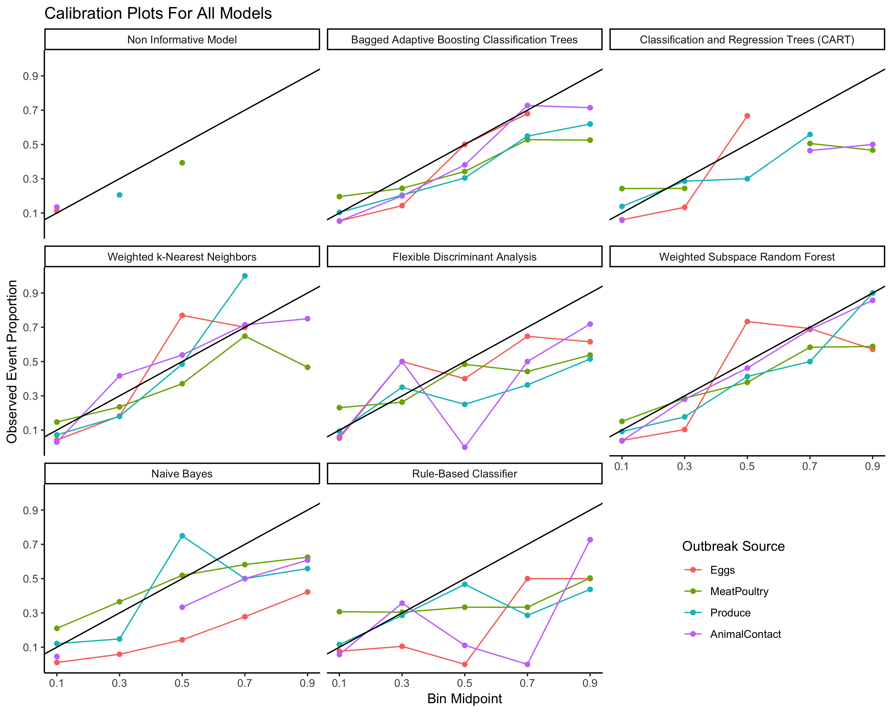

```{r global_options, include=FALSE}
knitr::opts_chunk$set(echo = FALSE, warning = FALSE, message = FALSE)
knitr::opts_knit$set(root.dir = '../')
```

```{r setup, include=FALSE}
load(file = 'DataProcessed/DataClean.RData')
#load(file = 'DataProcessed/Results.RData')
library(pander)
library(CIDAtools)
```
**Project:**`r CIDAtools::ProjectName()`
**PI:**`r CIDAtools::ProjectPI()`  
**Prepared By:**`r CIDAtools::ProjectAnalyst()`  
**Date:** `r paste(format(Sys.Date(), '%m/%d/%Y'))`  

# Introduction  

# Methods  
## Data
Data were collected from NORS 1998-2016 from NORS.

## Model Selection
Foodborne outbreaks were grouped into categories based on there food source as 
identified in NORS. 2196 outbreaks missing IFSAC information, 479 outbreaks caused by multiple sources, 51 unnclassifiable outbreaks, 145 outbreaks of undetermined source and 12 outbreaks from a source other
than animal or plant were removed. Food sources that were rare were removed (79 Dairy, 
19 Fish, 9 Game, 10 Grains-beans, 18 Nuts-seeds, 1 Oils-sugars, and 35 Aquatic 
Animals). The remaining outbreaks were classified as Eggs, Meat-Poultry, and Produce. 
We also included non foodbourne outbreaks caused by animal contact. 

Data were split into a training set (75%) and a testing set (25%). The number of 
total cases, the season the outbreak started, the geography of the outbreak 
(multistate, single state - multicounty, single state - single county), the agent
(STEC or Salmonella Serotype), the percentage of female and male cases, the 
percentage of people hospitalized, and the percentage of cases in each age group
(Under 1 year, 1-4 yrs, 5-9 yrs, 10-19 yrs, 20-49 yrs, 50- 74 yrs, 75 yrs and
older) were used as predictors. We selected four algorithmic methods for predicition based on their ability to predict 
mutliple class probabilities well - Adaptive bagging, classification and regression trees (CART), weighted k nearest neighbots (knn), and flexible discriminant analysis 
(FDA). The final model was chosen based on Brier 
Scores (a measure of the difference in the predicted probability and the actual 
event). In order to more accurately reflect actual usage, foodbourne outbreaks 
of other origin were included in the testing set, 
outbreaks with multiple, unclassifiable and no identified food sources were not. Parameter selection was 
performed using the Caret package. 

# Results  
All four models performed well, the Adaptive bagging model had a brier score of 
0.145, CART of 0.146, weighted k nearest neighbors of 0.125 and FDA of 0.143.
Calibration curves based on the testing data set are shown inn Fig 1. 




